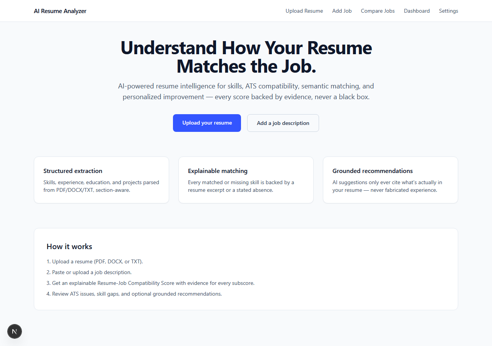
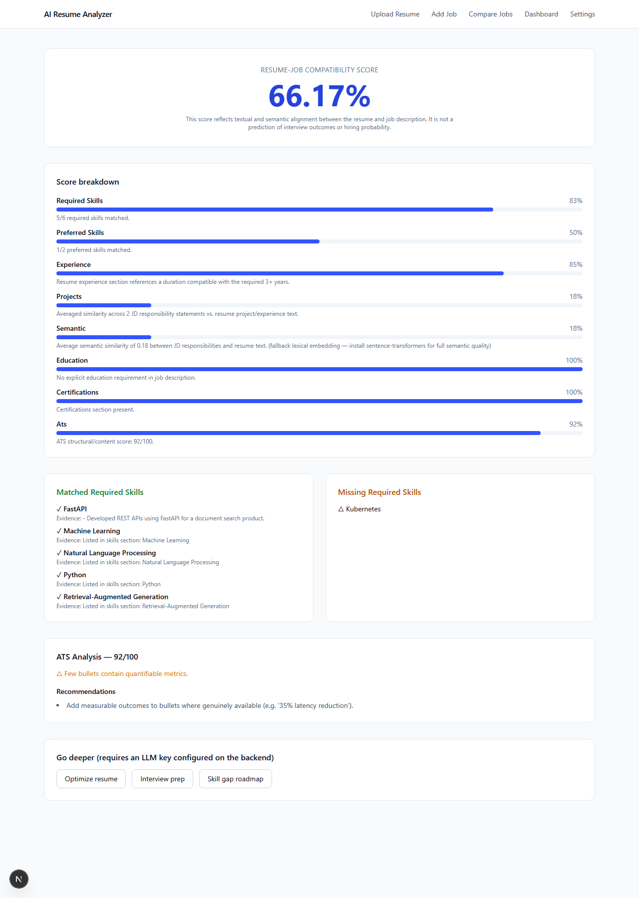
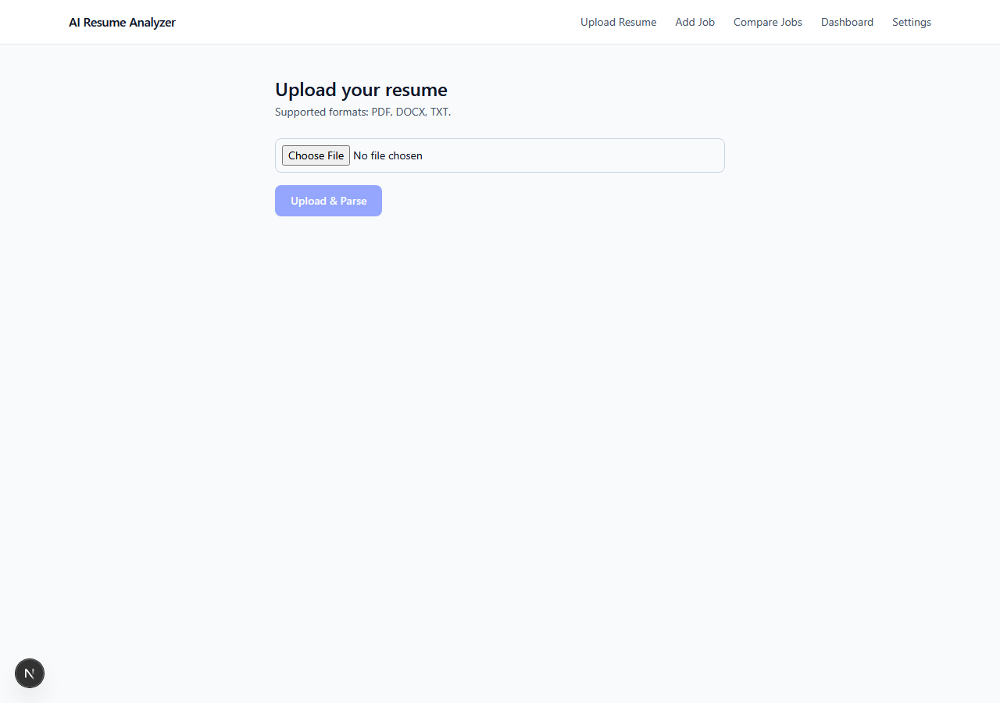
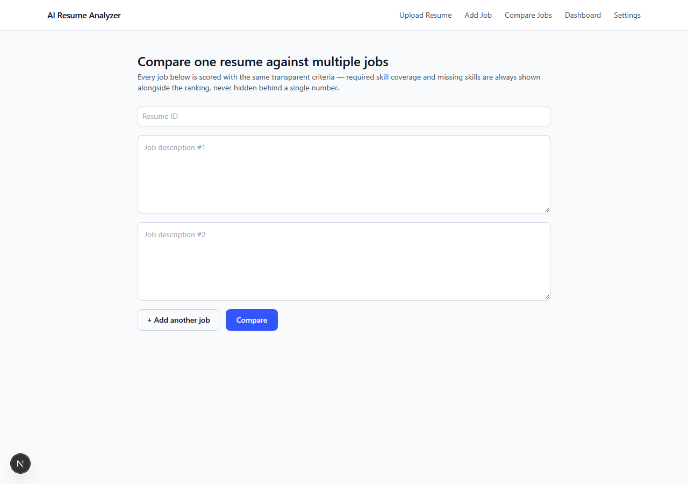

# AI Resume Analyzer & Job Matcher

Explainable resume-job compatibility analysis: deterministic resume/JD parsing, a
normalized skill taxonomy, multi-layer matching (exact/alias/semantic), an
itemized "Resume-Job Compatibility Score" with evidence for every subscore, an
ATS risk analyzer, a RAG-grounded LLM layer for recommendations/optimization/
interview prep/learning roadmaps, and a lightweight multi-agent orchestrator
that ties the whole pipeline into one consolidated report.

This is a real, incrementally-built project — see **Build status** below for
exactly what is implemented vs. scaffolded, so nothing here is oversold.

## Screenshots

| Landing | Analysis dashboard |
|---|---|
|  |  |

| Upload resume | Multi-job comparison |
|---|---|
|  |  |

More pages (dashboard, settings, add job) in [docs/screenshots/](docs/screenshots/).

## Architecture

```
Frontend (Next.js 16/React 19/TS/Tailwind)
        │
        ▼
FastAPI backend (/api/v1)
        │
   ┌────┼───────────────────────────────────────────────┐
   ▼    ▼                                                ▼
Resume   JD Parser                                Auth (JWT) + ownership
Parser   (app/pipelines/jd_parser.py)              checks on every resource
(app/pipelines/resume_parser.py)
   │        │
   └───┬────┘
       ▼
Skill Taxonomy (deterministic, data/skills/*.json)
       ▼
Matching Engine (app/scoring/matching_engine.py)
 exact/alias match + semantic similarity (embeddings) + evidence lookup
       ▼
Compatibility Score (app/scoring/compatibility_score.py)
 required skills 30% / preferred 10% / experience 20% / projects 15% /
 semantic 10% / education 5% / certifications 5% / ATS 5% — weights configurable
       ▼
ATS Analyzer (app/scoring/ats_analyzer.py)
       ▼
RAG knowledge base (app/retrieval/) ──► (optional) LLM layer (app/services/recommendation_service.py)
 chunk+embed data/knowledge/*.md          recommendations / optimization / interview questions /
 into a vector store, retrieved as        learning roadmap — grounded in resume+JD text (+ retrieved
 grounding context per request            knowledge passages), structured JSON, never fabricates
       │                                         │
       └───────────────┬─────────────────────────┘
                        ▼
        Agent Supervisor (app/agents/supervisor.py)
   orchestrates deterministic + LLM agents into one Phase-64-style report
                        ▼
        PostgreSQL (resumes, jobs, analyses, recommendations, users, audit_logs)
                        │
        Celery + Redis (app/workers/) — optional async path for expensive steps
```

Everything through the Compatibility Score is **deterministic** — no LLM call
required to get a full, explainable match result. The LLM is used only where
genuine reasoning is needed (recommendations/optimization/interview prep/
roadmap), grounded in the actual resume/JD text plus retrieved knowledge-base
passages, with an explicit no-fabrication instruction.

## What's implemented (real, tested code)

**Core deterministic pipeline**
- Resume parsing (PDF/DOCX/TXT, OCR fallback for scanned PDFs): [document_extractor.py](backend/app/pipelines/document_extractor.py), [section_detector.py](backend/app/pipelines/section_detector.py), [entity_extractor.py](backend/app/pipelines/entity_extractor.py), [resume_parser.py](backend/app/pipelines/resume_parser.py)
- Skill taxonomy & normalization (aliases, categories): [skill_taxonomy.py](backend/app/services/skill_taxonomy.py), data in [data/skills/](data/skills/)
- JD parsing (required vs. preferred, experience/education requirements, responsibilities): [jd_parser.py](backend/app/pipelines/jd_parser.py)
- Matching engine (exact/alias + semantic similarity + evidence): [matching_engine.py](backend/app/scoring/matching_engine.py)
- Explainable compatibility score: [compatibility_score.py](backend/app/scoring/compatibility_score.py)
- ATS analyzer: [ats_analyzer.py](backend/app/scoring/ats_analyzer.py)

**RAG + LLM + agents**
- Knowledge base (chunking, embeddings, in-memory or Qdrant vector store): [app/retrieval/](backend/app/retrieval/), source docs in [data/knowledge/](data/knowledge/)
- Swappable LLM/embedding providers (Anthropic/OpenAI/local, offline-safe embedding fallback): [app/providers/](backend/app/providers/)
- Grounded recommendation/optimization/interview/roadmap service, RAG-augmented: [recommendation_service.py](backend/app/services/recommendation_service.py)
- Multi-agent supervisor (deterministic agents always run; LLM agents optionally layer on top): [app/agents/](backend/app/agents/)

**Platform**
- FastAPI app: auth (JWT), resume/job/matching/comparison/recommendation/agent endpoints, ownership enforcement on every owned resource, structured errors, request-ID logging: [main.py](backend/app/main.py), [app/api/](backend/app/api/)
- Celery + Redis async task path for resume parsing / JD parsing / matching, as an alternative to the synchronous endpoints: [app/workers/](backend/app/workers/)
- SQLAlchemy models for users/resumes/jobs/analyses/recommendations/audit_logs: [orm.py](backend/app/models/orm.py)
- Evaluation harness (precision/recall/F1 against a gold dataset) with regression-guarding tests: [app/evaluation/](backend/app/evaluation/), gold data in [data/evaluation/](data/evaluation/)
- **33 passing backend unit tests** plus a full end-to-end API smoke test (auth, upload, ownership enforcement, matching, agents, comparison)
- Next.js frontend: landing, resume upload, JD input, analysis dashboard, multi-job comparison, resume optimization, interview prep, learning roadmap, dashboard, and settings/auth pages — all wired to the real API: [frontend/app/](frontend/app/)
- Docker Compose (Postgres, Redis, backend, frontend) and per-service Dockerfiles
- GitHub Actions CI (backend lint+test, frontend typecheck+build)

## Scaffolded / not yet built (honest gaps)

- Qdrant/pgvector wired as the *production* vector store (the adapter exists in [vector_store.py](backend/app/retrieval/vector_store.py) and is used by default in-memory; swapping to a live Qdrant instance is one config change but untested here without a running Qdrant)
- Resume versioning UI and a semantic career graph (Phase 62) — not built
- Job-description-from-URL scraping (Phase 12's optional URL ingestion)
- Full docs set beyond this README + inline module docstrings (no separate ARCHITECTURE.md/API.md/SECURITY.md yet)
- Retry/backoff policy tuning for LLM structured-output repair beyond the single JSON-repair pass already in [anthropic_provider.py](backend/app/providers/anthropic_provider.py)

## Local setup

### Backend
```bash
cd backend
python -m venv .venv
.venv/Scripts/activate   # or source .venv/bin/activate on macOS/Linux
pip install -r requirements.txt
cp ../.env.example ../.env   # fill in DATABASE_URL / API keys
uvicorn app.main:app --reload
```

Run tests (no live Postgres required — they exercise the deterministic pipeline directly):
```bash
pytest -q
```

Run the evaluation harness directly:
```bash
python -m app.evaluation.run_eval
```

Run a Celery worker (optional, for the async endpoints under `/api/v1/async/*`):
```bash
celery -A app.workers.celery_app worker --loglevel=info
```

### Frontend
```bash
cd frontend
npm install
cp .env.local.example .env.local
npm run dev
```

### Full stack with Docker
```bash
cp .env.example .env
docker compose up --build
```

## API examples

```bash
curl -X POST http://localhost:8000/api/v1/resumes/upload -F "file=@resume.pdf"

curl -X POST http://localhost:8000/api/v1/jobs/analyze \
  -H "Content-Type: application/json" \
  -d '{"text": "GenAI Engineer... Required: Python, FastAPI..."}'

curl -X POST http://localhost:8000/api/v1/matching/analyze \
  -H "Content-Type: application/json" \
  -d '{"resume_id": "...", "job_id": "..."}'

# Full agent pipeline in one call (deterministic sections always; LLM sections if include_llm_agents=true and a key is configured)
curl -X POST http://localhost:8000/api/v1/agents/analyze \
  -H "Content-Type: application/json" \
  -d '{"resume_id": "...", "job_id": "...", "include_llm_agents": true}'
```

## Safety principles enforced in code

- The overall score is always labeled **"Resume-Job Compatibility Score"**, never a hiring probability ([compatibility_score.py](backend/app/scoring/compatibility_score.py)).
- Every matched skill carries an evidence snippet or an explicit "no evidence found" ([matching_engine.py](backend/app/scoring/matching_engine.py)).
- LLM prompts explicitly forbid inventing employers/projects/metrics/certifications not present in the source resume text ([recommendation_service.py](backend/app/services/recommendation_service.py)).
- Structured LLM output is requested via JSON schema and validated before use; malformed output surfaces raw text rather than being silently accepted.
- Resumes/jobs created while signed in are owner-only; anonymous access to an owned resource is rejected with 403 ([deps.py](backend/app/api/deps.py)).

## License

MIT (see [LICENSE](LICENSE)).
